<p align="center">
  
</p>

<h1 align="center">Keepix</h1>

<p align="center">Local-first Android photo and video cleanup</p>

<p align="center">
  
  
  
  
  
</p>

<p align="center">
  <a href="README.md">English</a> · <a href="README.zh-CN.md">中文</a>
</p>

## Overview

Keepix turns a crowded camera roll into a clean, swipeable workflow. It scans local media through Android `MediaStore`, keeps cleanup state on the device, and stays focused on fast review instead of cloud features or account friction.

Official Website:[Keepix — Organize your gallery like swiping short videos](https://www.quentincrane.cn/work/keepix/)

### Start here

1. Open the app（Download in release or the official website） and grant photo or video access.
2. Pick the cleanup flow you want to work through.
3. Swipe to keep, favorite, or delete.
4. Return later for trash, favorites, similar shots, and history views.

### Why it feels useful

- Photo and video cleanup use continuous swipe decks instead of dense lists.
- Favorites, trash, and similar photos stay in their own flows.
- Deletion goes through the app trash first, then Android's confirmation flow for permanent removal.
- Today in History, achievements, and lightweight return paths keep the app useful after the first cleanup session.
- Phone and tablet layouts keep the main actions close to where your hand or pointer already is.

### What it covers

- Photo cleanup with keep, favorite, delete, undo, and time-based filters.
- Video cleanup with staged review, temporary keep, and commit-on-exit behavior.
- Similar photo detection with cached fingerprints and background progress.
- Separate favorites and trash views for photos and videos.
- A device-local settings center for layout, behavior, feedback, and maintenance.

### Privacy first

- No accounts, subscriptions, ads, or cloud sync.
- No photo or video uploads.
- Settings, statistics, cleanup state, and favorites stay on the device.
- Permanent deletion follows Android's permission flow.

### Screenshots

<p align="center">
  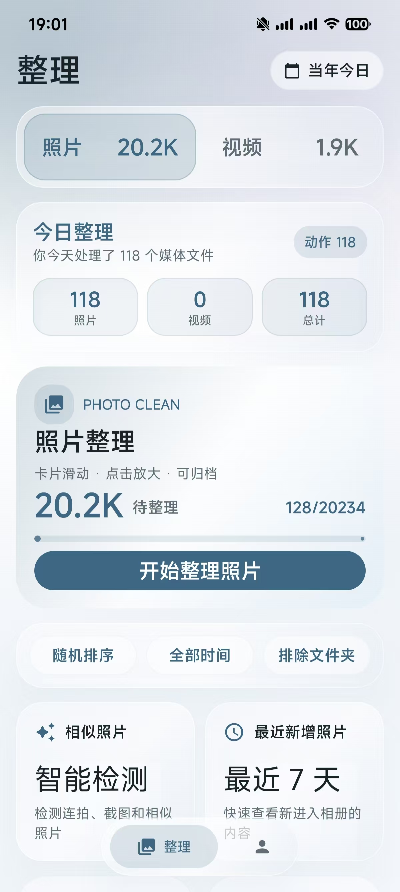
  &nbsp;&nbsp;
  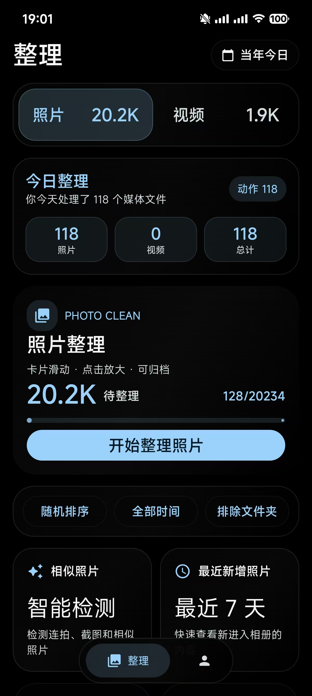
</p>

<p align="center">
  <em>Home — daily cleanup stats, photo &amp; video entry points, similar photo detection</em>
</p>

<br>

<p align="center">
  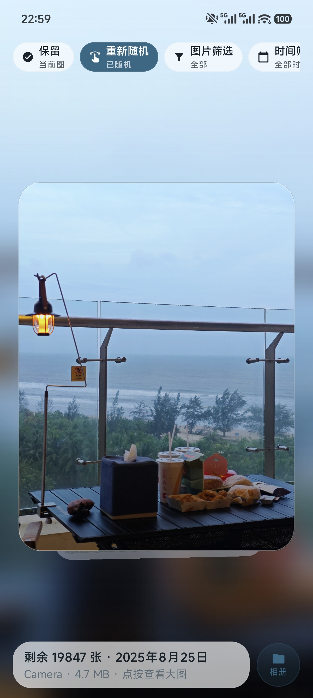
  &nbsp;&nbsp;
  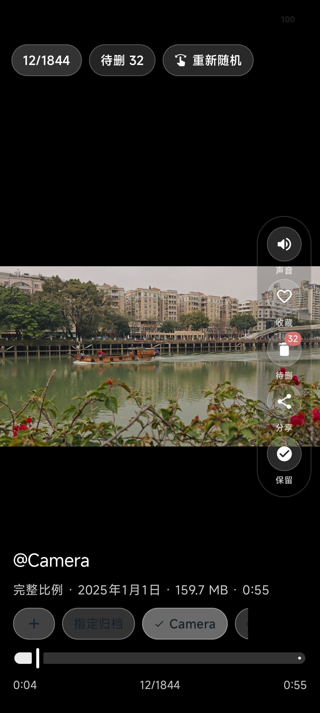
</p>

<p align="center">
  <em>Swipeable cleanup — keep, favorite, or delete photos and videos</em>
</p>

<br>

<p align="center">
  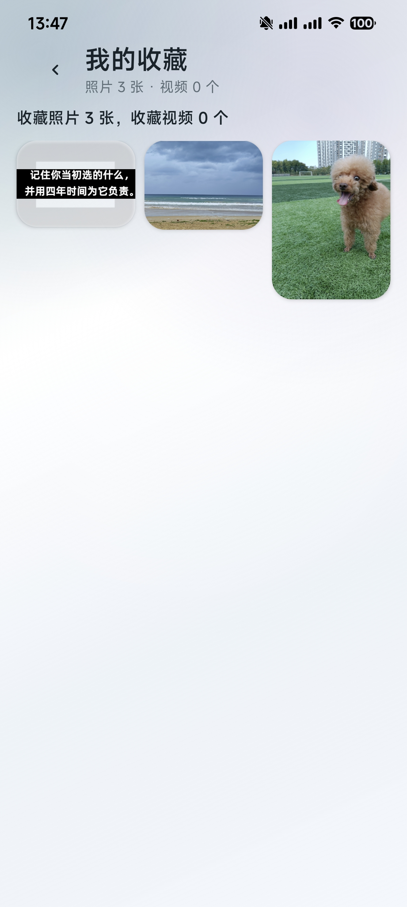
  &nbsp;&nbsp;
  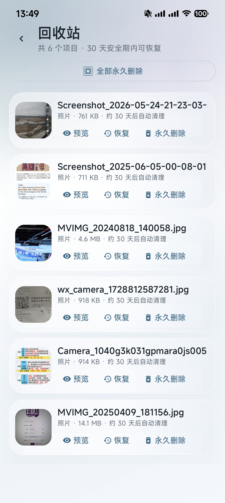
</p>

<p align="center">
  <em>Favorites &amp; Trash — 30-day recovery window before permanent deletion</em>
</p>

<br>

<p align="center">
  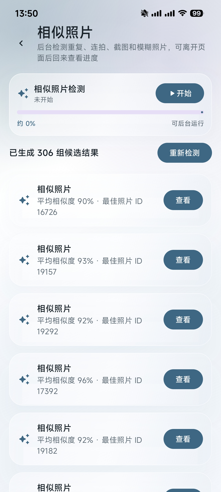
  &nbsp;&nbsp;
  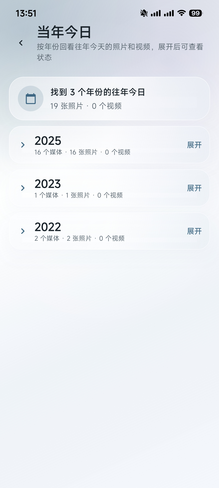
</p>

<p align="center">
  <em>Similar photo detection &amp; Today in History</em>
</p>

<br>

<p align="center">
  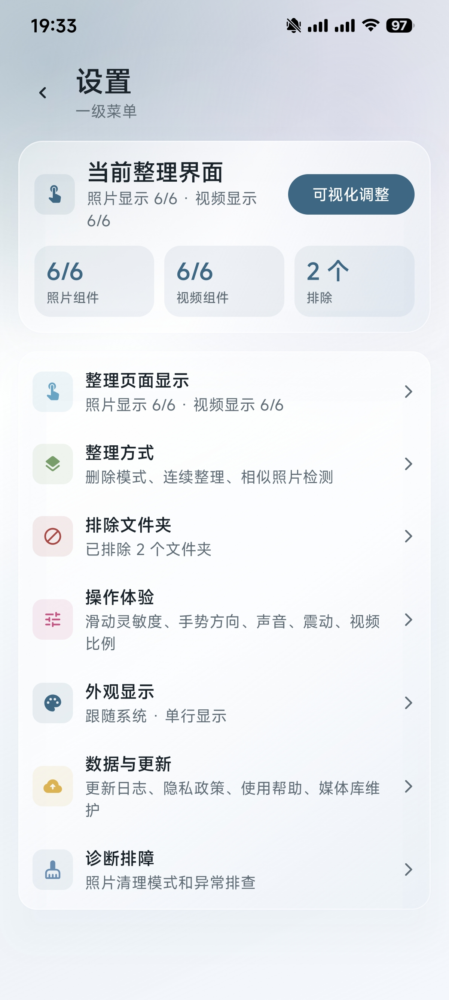
  &nbsp;&nbsp;
  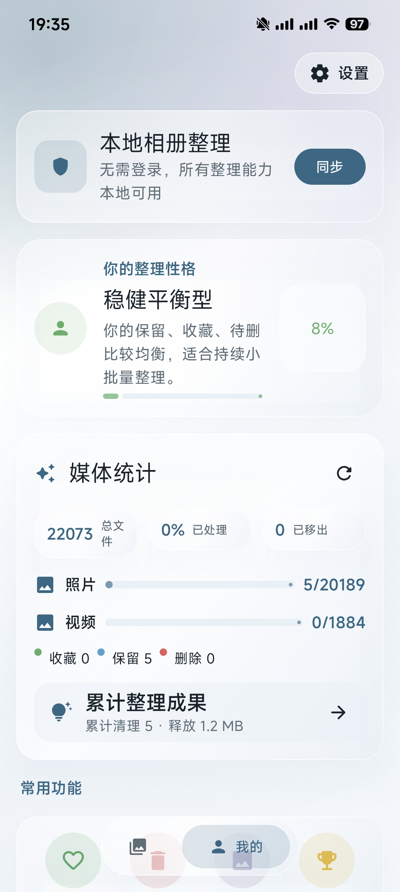
</p>

<p align="center">
  <em>Settings &amp; Profile — customize behavior, view media statistics</em>
</p>

<br>

<p align="center">
  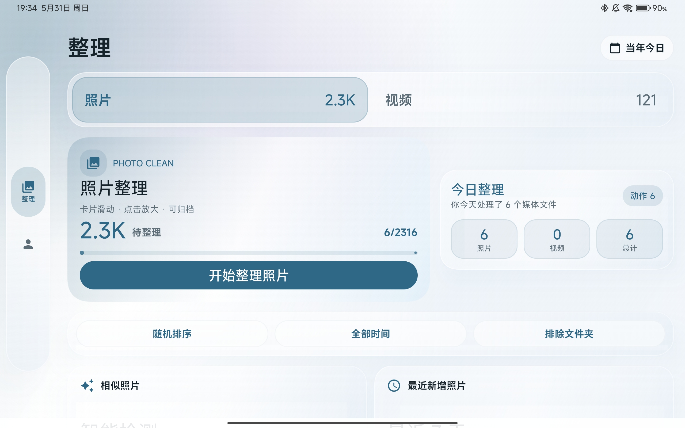
</p>

<p align="center">
  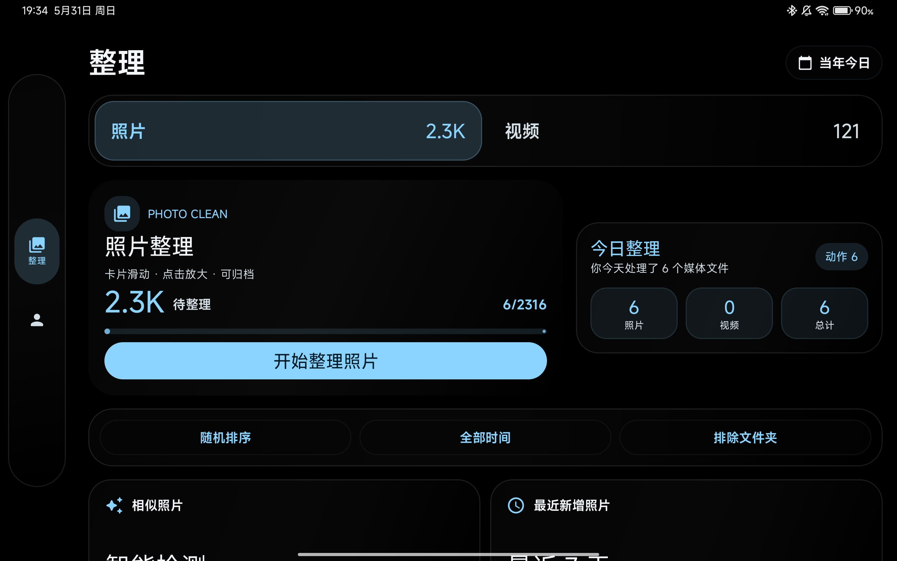
</p>

<p align="center">
  <em>Adaptive tablet layout with floating rail navigation</em>
</p>

### More for builders

- [Technical Overview](docs/en/technical_overview.md) - product scope, architecture notes, and behavior boundaries
- [Privacy Notes](docs/en/privacy.md) - what the app reads, stores, and never sends off device
- [Build Guide](docs/en/build.md) - debug and release commands, signing flow, and APK outputs
- [Release Notes Draft](docs/en/release_notes.md) - current release copy and publish checklist
- [AI Handoff Notes](docs/en/AI_HANDOFF.md) - public repo context for the next maintainer or agent

<details>
<summary>Developer notes</summary>

Windows build:

```powershell
.\gradlew.bat :app:assembleDebug
```

macOS / Linux build:

```bash
./gradlew :app:assembleDebug
```

Debug APK:

```text
app/build/outputs/apk/debug/app-debug.apk
```

Version requirements:

- `minSdk = 30`
- `targetSdk = 35`
- `compileSdk = 35`
- JDK 17

Stack:

- Kotlin `2.0.21`
- Jetpack Compose `1.8.2`
- Material 3 `1.3.2`
- Room `2.7.1`
- DataStore `1.1.7`
- Media3 `1.6.1`
- Coil `2.7.0`

Project layout:

```text
.
├── app/                     Android app module
├── docs/                    Public technical notes, privacy, and release docs
├── gradle/wrapper/          Gradle Wrapper
├── scripts/windows/         Windows helper scripts
├── build.gradle.kts
├── settings.gradle.kts
├── gradle.properties
└── local.properties.example
```

</details>

## License

This project is licensed under [Apache License 2.0](LICENSE).

The repository also includes [NOTICE](NOTICE) to preserve the original project attribution: `https://github.com/QuentinCrane/Keepix`.
